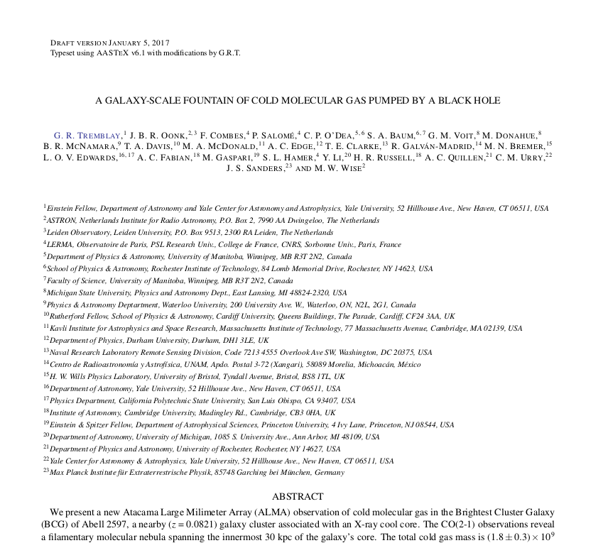
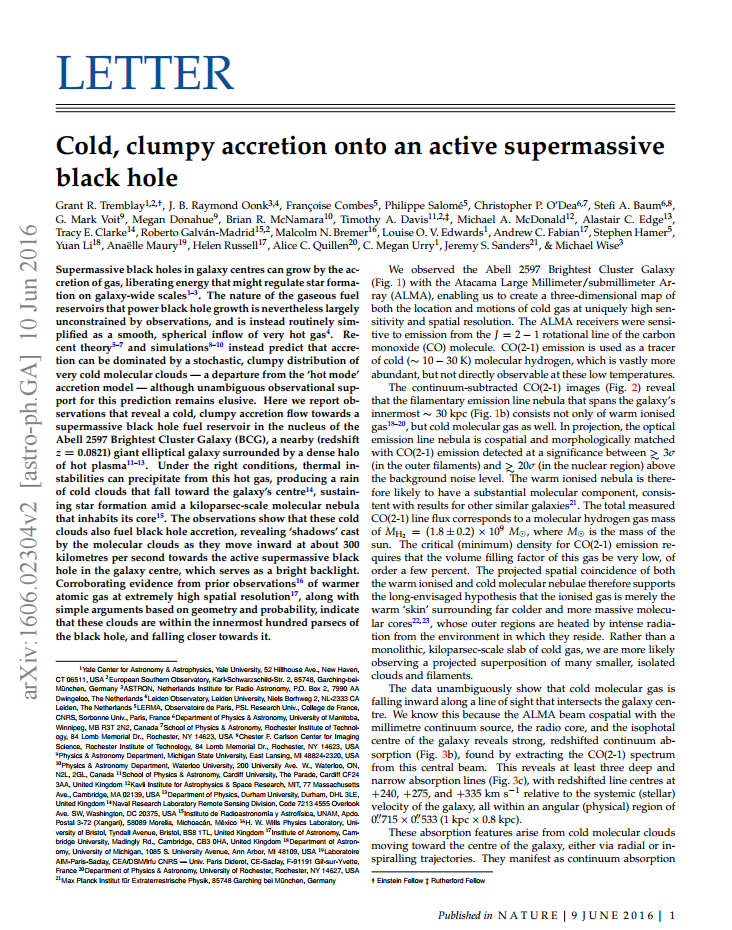

# LaTeX Templates for Astronomy Journals

[Grant Tremblay](http://www.granttremblay.com/)'s modified LaTeX templates for popular astronomy journals. 

### *The Astrophysical Journal*

My ApJ template is found here as [grant_aastex.cls](grant_aastex.cls). ApJ's page format is best reproduced by Alexey Vikhlinin's famous `emulateapj` package [(still available here)](http://hea-www.harvard.edu/~alexey/emulateapj/).  The AAS recently adopted most of `emulateapj`'s style and functionality as part of `AASTeX v6.X`.  My version is only slightly tweaked from `AASTeX v6.1`, ([available here](http://journals.aas.org/authors/aastex.html)).  I've made a few modifications to their `hyperref` implementation, the philosophy behind which can be [found here](http://www.astrobetter.com/blog/2014/09/29/latex-hyperref-and-emulateapj/). 

### *Nature*

The template [grant_nature.cls](grant_nature.cls) emulates the look of a [*Nature*](http://www.nature.com/) Letter. *Nature* print is typeset using the font *Minion Pro*. This font is [no longer supported](https://arxiv.org/help/faq/freefonts) by arXiv. The closest free and arXiv-supported font I could find (which should be availble by default with a typical LaTeX installation) is *Palatino*. This font - along with its Math equivalent - is niceley implemented with the `mathpazo` package. 

